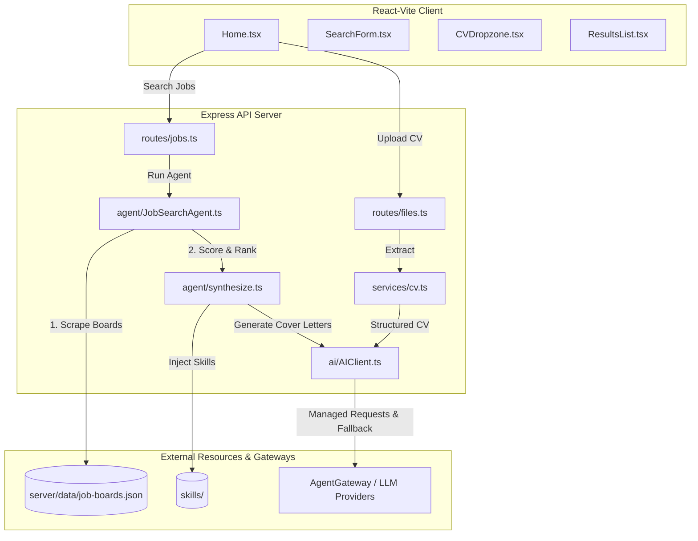

# 🏆 DevOps Intensive Hackathon Solution — JobMatch (Scout AI Assistant)

> **Hackathon Solution Repository**: Complete platform engineering solution for the **DevOps Intensive Hackathon** task — transforming the **Scout AI Assistant** prototype into a production-grade, secure, and cost-effective cloud-native system with GitOps (FluxCD), CI/CD, automated LLM evaluation gates, PII protection, and FinOps budgeting.

---

## 📋 Hackathon Task: Scout — Job Searcher AI Assistant

<details open>
<summary><b>Task Specification (from <a href="doc/hackathon-task.md">doc/hackathon-task.md</a>)</b></summary>

### Context
The Scout startup has just raised a seed round for its AI job search assistant: it reads CVs, matches job postings, and drafts cover letters. The demo to investors went brilliantly, running on the founder's laptop with a single hardcoded API key and the system prompt hidden in a code comment.

Now, with the first 5,000 active users on the horizon, the legal team is nervous about GDPR, and the CFO just saw the first LLM provider invoice.

The founders are hiring you as their DevOps/Platform engineering team. The Scout application works (more or less). Your job is to transform this prototype into a production-ready system that will scale under load, secure candidate resumes, and keep operational costs within budget.

### Goal
Build and demonstrate a prototype of a complete engineering loop (Harness) around this agentic AI application: from commit to production deployment, featuring built-in evaluation gates, PII protection, and FinOps budgeting.

### Requirements & Scope
*Example repo: [devops-sre-job-match-app-example](https://github.com/GregoryKoshelenko/devops-sre-job-match-app-example)*

1. **SDLC & "How to Build"**: Monorepo structure (`app/`, `platform/`, `evals/`), CI workflow (lint → unit tests → build → push images), CD workflow (FluxCD/ArgoCD reconciling cluster state on main merge), environment promotion (dev → staging → prod), versioned prompts & skills (`SKILL.md`) evaluated on PR.
2. **Harness Engineering**: Memory (candidate profiles + vector store job cache), skills (`SKILL.md` capability footprints), MCP (Model Context Protocol) tool integration.
3. **Testing**: Unit and integration tests for request formatting, tool calls, retries, and timeouts.
4. **Eval Suite (`evals/`)**: Test cases for ranking and cover letter quality, LLM-as-a-Judge CI gate (blocks PR if score < baseline), regression datasets for prompt injection and PII leaks.
5. **Security**: Prompt injection defense (XML context boundary), PII minimization/data governance, secrets management via gateway proxy (AgentGateway / ESO), signed images/digests, output guardrails.
6. **Hosting & AI Providers**: Multi-provider support (Claude, Gemini, OpenAI) to prevent vendor lock-in; price comparison per 1M tokens.
7. **FinOps Model**: Cost projection (5,000 users, 20 searches/month, ~3K input + ~800 output tokens) and unit metric: cost-per-active-user.

</details>

### Deliverables & Documentation Matrix

| Required Deliverable | Description | Implementation Link |
|---|---|---|
| **1. ADR** | Architectural Decision Records justifying design, model choices, and FinOps | 📑 **[doc/ADR.md](doc/ADR.md)** |
| **2. HLD** | High-Level Solution Design (components, lifecycles, K8s deployment) | 📐 **[doc/HLD.md](doc/HLD.md)** |
| **3. LLD** | Low-Level Design (code architecture, schemas, testing, CI/CD/GitOps) | 🔧 **[doc/LLD.md](doc/LLD.md)** |
| **4. Task Spec** | Original hackathon challenge statement and deliverables criteria | 📋 **[doc/hackathon-task.md](doc/hackathon-task.md)** |
| **5. GCP Dev Setup** | Step-by-step setup for GCP dev environment & FluxCD platform launch | ☁️ **[doc/manuals/gcp-dev-setup.md](doc/manuals/gcp-dev-setup.md)** |
| **6. Ukrainian Docs** | Full Ukrainian translations for architecture documentation | 🇺🇦 **[doc/ukr/](doc/ukr/)** |
| **7. Code & Manifests** | Full application, platform manifests, evals, scripts, and GitOps overlays | [`app/`](app/), [`platform/`](platform/), [`evals/`](evals/), [`scripts/`](scripts/) |

---

## 💡 Solution Overview & Core Features

**JobMatch** is the production-ready implementation of the Scout AI assistant:

* 📄 **CV Ingestion & Extraction**: Accepts PDF/text resumes, extracts content via `pdf-parse`, and generates structured candidate profiles using LLMs.
* 🔍 **Agentic Job Search**: Queries regional boards (`DOU.ua`, `Work.ua`, `Djinni.co`, `Remote OK`) via native scrapers (`cheerio`) with automatic fallback to LLM web search APIs.
* ⚖️ **Weighted Scoring & Cover Letters**: Injects versioned Agent Skills ([`app/skills/`](app/skills/)) to rank jobs (35% skills, 20% experience, 20% domain fit, 15% gap severity, 10% growth) and drafts personalized cover letters.
* 🛡️ **Active Gateway Routing & Fallback**: `AgentGateway` manages credentials, enforces rate limits, scrubs PII, and performs automatic failover between LLM providers (e.g. Claude Haiku ↔ Gemini Flash) with 90s circuit-breaker eviction.

---

## 🏗️ Architecture & Code Flow



---

## 📂 Monorepo Structure

```
├── app/                      # Application zone
│   ├── src/                  # React/Vite SPA frontend
│   ├── server/               # Node.js Express API & Agent worker
│   ├── skills/               # Versioned agent skills (markdown)
│   └── prompts/              # LLM system prompts and templates
├── platform/                 # Infrastructure zone (GitOps)
│   ├── flux/                 # FluxCD cluster configs (dev & prod overlays)
│   └── helm/                 # Helm charts (AgentGateway, Redis, Qdrant)
├── evals/                    # Quality Gate zone
│   ├── dataset.json          # Golden test cases (relevance, tone, security)
│   └── run-evals.mjs         # LLM-as-a-Judge evaluation runner
├── scripts/                  # Developer tooling & synchronization scripts
│   ├── pre-commit            # Gitleaks pre-commit hook to block secret leaks
│   └── sync-skills.sh        # Syncs agent skills into Helm chart packaging
└── doc/                      # Documentation (ADR, HLD, LLD, Task, Translations)
```

---

## 🚀 Quick Start

### Prerequisites
* **Node.js v20+**
* **Docker & Docker Compose** (for containerized deployment)
* LLM provider API key *(optional — runs in **Demo Mode** with sample data if omitted)*

---

### Step 1: Configuration
Navigate to the application folder and initialize your environment file:
```bash
cd app
cp .env.example .env
```

### Step 2: Choose How to Run

#### Option A: Run with Docker (Recommended)
```bash
# From within the app/ directory:
docker compose up --build
```
* **Web Interface**: [http://localhost:8080](http://localhost:8080)

#### Option B: Run Locally (Development Mode)
```bash
# From within the app/ directory:

# 1. Install dependencies for web client and API server
npm install && npm install --prefix server

# 2. Build TypeScript backend and compile job catalogs
(cd server && npm run build)

# 3. Start API and frontend dev servers concurrently
npm run dev
```
* **Frontend UI**: [http://localhost:5173](http://localhost:5173)
* **Backend API Health**: [http://localhost:3001/api/health](http://localhost:3001/api/health)

#### Option C: Deploy Dev Environment to GCP (GitOps)
Follow the step-by-step setup in ☁️ **[GCP Dev Environment Setup Guide](doc/manuals/gcp-dev-setup.md)**:
1. Provision a single GCP `e2-standard-2` VM running `k3s` (~$48/month topology).
2. Store LLM API keys in **Google Secret Manager** & grant IAM access to External Secrets Operator.
3. Bootstrap the cluster using **FluxCD** against `./platform/flux/clusters/dev`.

---

## 🧪 Quality & Security Gates

### Evaluation Suite (`evals/`)
Evaluates matching quality, tone, and guardrails via the **LLM-as-a-Judge** pattern:
```bash
cd evals
npm install
npm test
```
* **CI Gate**: Triggered on changes to `skills/` or `prompts/`. Pull requests are blocked if the average score falls below **4.2 / 5.0** or if any safety check fails.
* **Evaluated Metrics**: Relevance, Tone, Hallucination-free, and Safety/Guardrails (prompt leaks and bias).

### Security Controls
* **PII Masking**: Candidate emails, phones, and profile links are scrubbed locally before external LLM calls.
* **Prompt Injection Shield**: Strict XML tag delimiters isolate untrusted user inputs from system instructions.
* **Secrets Governance**: Zero plaintext credentials in Git; secrets managed via External Secrets Operator / AgentGateway `secretRef`.
* **CI Scans**: Automated **Gitleaks** secret detection on every commit.