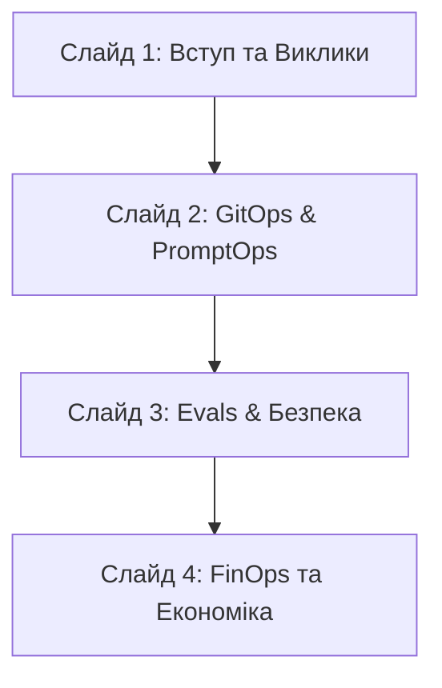

# Презентація проекту JobMatch (Scout) — AI-Powered Job Matching Engine

Цей документ містить структуру та детальний вміст для **4-слайдової презентації** вашого хакатон-проекту. Презентація орієнтована на інвесторів, технічних лідерів та SRE/DevOps журі, фокусуючись на перетворенні сирого прототипу на стійку, безпечну та економічно вигідну production-ready платформу




---

## 🖥️ Слайд 1: JobMatch: Від наколінного прототипу до Production-Ready AI-Платформи

**Мета слайду:** Задати контекст, розповісти про стартап Scout, окреслити головні проблеми прототипу та показати фінальне бачення.

### 📌 Вміст слайду

* **Заголовок:** JobMatch (Scout) — AI-Powered Job Matching Engine
* **Підзаголовок:** Трансформація AI-асистента у масштабовану та захищену платформу корпоративного рівня.
* **Проблема (З чим ми стартували):**
  * Додаток працював локально на ноутбуці засновника з єдиним хардкодженим API-ключем.
  * Системні промпти були приховані в коментарях коду.
  * Загроза витоку персональних даних кандидатів (PII) та неконтрольоване зростання витрат на LLM-провайдерів при наближенні до перших 5 000 користувачів.
* **Рішення (Що ми побудували):**
  * Повний інженерний контур (Harness) навколо AI-агента.
  * Автоматизований життєвий цикл розробки (SDLC), інтегровані ворота якості (Evals), захист даних на рівні шлюзу та FinOps-оптимізація.

> [!NOTE]
> **Візуальний акцент:** Порівняльна таблиця "Було (MVP)" vs "Стало (Production)".

| Критерій | Було (Локальний MVP) | Стало (Production-Ready) |
| :--- | :--- | :--- |
| **API Ключі** | Хардкод у коді | Ізольовані в Secret Manager / AgentGateway |
| **Деплоймент** | Локальний запуск | Автоматичний GitOps (FluxCD) у хмарі GCP |
| **Контроль якості** | Ручне тестування | Автоматичний LLM-as-a-Judge в CI/CD |
| **Безпека** | Промпти без захисту | PII Masking + XML Guardrails + WAF |

---

## 🖥️ Слайд 2: CI/CD & GitOps Loop: PromptOps та Розділення Середовищ

**Мета слайду:** Показати інфраструктурну зрілість проекту: використання монорепозиторію, повну автоматизацію розгортання та швидку доставку промптів без зайвих збірок Docker-образів.

### 📌 Вміст слайду

* **Заголовок:** GitOps-конвеєр та PromptOps як код
* **Основні тези:**
  * **Монорепозиторій з чіткими межами:** Відокремлено код додатка (`app/`), Kubernetes маніфести (`platform/`) та систему оцінки (`evals/`).
  * **Розділення середовищ (Dev/Prod):**
    * **Dev Cluster (k3d VM):** Відстежує гілку `dev`. Миттєвий автоматичний деплой через FluxCD (`reconcileStrategy: Revision`).
    * **Prod Cluster (GKE Autopilot):** Відстежує гілку `main`. Контрольований деплой через PR, що потребує ручного підвищення версії чарту (`reconcileStrategy: ChartVersion`) — захист від випадкових змін.
  * **Decoupled Delivery (PromptOps):**
    * Промпти та навички (`SKILL.md`) зберігаються в Git як код.
    * Зміна промпту **не** перезапускає 10-хвилинну збірку Docker-образу. Завдяки Kubernetes **ConfigMap**, зміни синхронізуються миттєво (<5 сек) через rolling update подів.

> [!TIP]
> **Схема доставки змін:**
> `Код / Промпт в Git` ➡️ `GitHub Actions (CI/Evals)` ➡️ `GHCR / ConfigMap` ➡️ `FluxCD Reconcile` ➡️ `Поди у Kubernetes`

---

## 🖥️ Слайд 3: AI Quality Gates (Evals) та Багаторівнева Безпека

**Мета слайду:** Пояснити, як ми гарантуємо якість відповідей AI-агента і захищаємо персональні дані користувачів та інтелектуальну власність стартапу.

### 📌 Вміст слайду

* **Заголовок:** Безпека даних та Ворота Якості (Evals)
* **Контроль якості в CI (LLM-as-a-Judge):**
  * Створено золотий набір тестів (`dataset.json`) для перевірки релевантності вакансій та якості супровідних листів.
  * Автоматичний суддя (LLM-as-a-Judge) оцінює відповіді за шкалою 1-5 за критеріями: *Relevance, Tone, Hallucination-free, Safety-guardrails*.
  * **CI Gate:** Злиття PR у гілку блокується, якщо середній бал падає нижче **4.2 / 5.0** або провалено тести на ін'єкції.
* **Багаторівневий захист:**
  * **PII Masking:** Автоматичне маскування email, телефонів та посилань на локальному рівні backend-сервера перед надсиланням у хмару.
  * **Prompt Injection Shield:** Розділення інструкцій та небезпечних користувацьких даних за допомогою XML-тегів.
  * **Secrets Isolation:** Жодних API-ключів у подах додатка. Ключі зберігаються у Kubernetes Secrets та інжектуються виключно на рівні централізованого проксі **AgentGateway**.

> [!IMPORTANT]
> **Результат:** Юристи спокійні щодо відповідності GDPR, а розробники впевнені, що оновлення промпту не погіршить поведінку AI-агента.

---

## 🖥️ Слайд 4: FinOps: Розумна Маршрутизація та Економіка Проекту

**Мета слайду:** Довести фінансову життєздатність проекту. Показати розрахунки вартості на 5 000 користувачів та економію завдяки гібридному вибору моделей та оптимізаціям.

### 📌 Вміст слайду

* **Заголовок:** FinOps-модель та Оптимізація Витрат
* **Базові метрики розрахунку (5 000 користувачів / 20 пошуків на місяць / 100k запитів):**
  * Середній запит: 3 000 вхідних токенів (резюме, опис вакансій).
  * Середня відповідь: 800 вихідних токенів (аналіз, супровідний лист).
* **Гібридна маршрутизація (Hybrid Smart Routing):**
  * **80% простих завдань** (первинний скринінг, парсинг вакансій) направляються на наддешеву **gemini-2.5-flash-lite** ($0.075 / 1M input).
  * **20% складних завдань** (глибокий аналіз резюме, генерація листа) йдуть на якісну **claude-haiku-4-5** ($1.00 / 1M input).
* **Додаткові важелі оптимізації (Levers):**
  * Кешування контексту промптів (зменшує вартість повторних токенів до 90%).
  * Кешування пошукових запитів у Redis на 12 годин.
  * Ефемерна (stateless) векторна база даних Qdrant (нульові витрати на SSD PVC диски в GKE).

> [!WARNING]
> **Економічний ефект:** Зниження витрат на LLM на **74.7%** порівняно з використанням суто моделі Claude Haiku, при збереженні 98% якості генерації.

### 📊 Порівняння сценаріїв витрат (на місяць)

```
[Сценарій 1] Лише Claude Haiku:     ████████████████████ $700.00 (Unit: $0.14 / користувач)
[Сценарій 2] Лише Gemini 3.5 Flash: ███████████ $390.00 (Unit: $0.078 / користувач)
[Сценарій 3] Гібридна модель (Наш):   █████ $177.20 (Unit: $0.0354 / користувач)
[Сценарій 4] Лише Gemini Lite:      █ $46.50 (Unit: $0.0093 / користувач)
```
